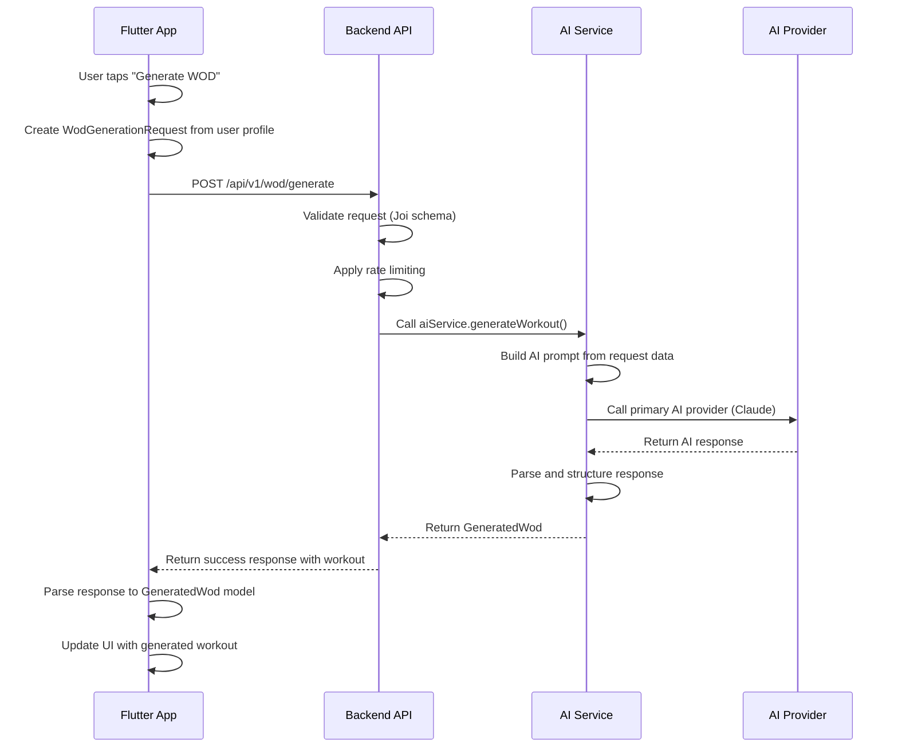
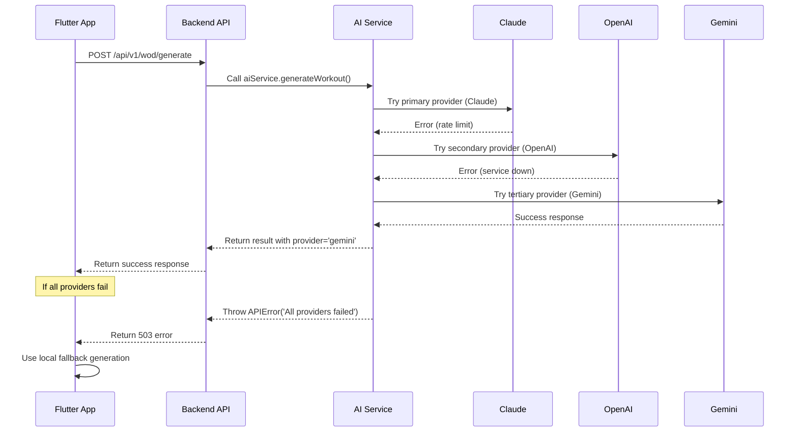

# CrossFit WOD AI - Flutter Integration Guide

## Overview

This document provides comprehensive guidance for integrating the CrossFit WOD AI backend with Flutter applications. It covers API contracts, data flow patterns, error handling, and best practices for mobile integration.

## Backend Project Structure

```
crossfit-wod-ai-backend/
├── src/
│   ├── config/
│   │   └── ai.js                 # AI provider configuration
│   ├── middleware/
│   │   ├── auth.js              # Authentication middleware
│   │   ├── errorHandler.js       # Error handling
│   │   └── requestLogger.js      # Request logging
│   ├── routes/
│   │   ├── health.js            # Health check endpoints
│   │   └── wod.js               # WOD generation endpoints
│   ├── services/
│   │   └── aiService.js         # AI integration service
│   └── utils/
│       └── validation.js         # Request validation
├── docs/
│   ├── API_DOCUMENTATION.md     # Complete API reference
│   └── FLUTTER_INTEGRATION_GUIDE.md
├── tests/
│   ├── unit/
│   └── integration/
├── .env.example                 # Environment configuration template
├── server.js                    # Main server entry point
└── package.json                 # Dependencies and scripts
```

## API Contract for Flutter Integration

### 1. Authentication Flow

#### API Key Authentication (Current Implementation)
The Flutter app must include the API key in all requests:

```javascript
// Backend middleware expects this header
const apiKey = req.headers['x-api-key'];

// Flutter should send
headers: {
  'X-API-Key': 'your_api_secret_key_here',
  'Content-Type': 'application/json'
}
```

#### JWT Authentication (Future Implementation)
```javascript
// Backend JWT middleware
const token = req.headers.authorization?.split(' ')[1];
const decoded = jwt.verify(token, process.env.JWT_SECRET);

// Flutter should send
headers: {
  'Authorization': 'Bearer ${jwtToken}',
  'Content-Type': 'application/json'
}
```

### 2. Request/Response Formats

#### Standard Success Response Format
```javascript
// Backend sends this format for all successful responses
{
  "success": true,
  "data": {
    // Actual response data
  },
  "metadata": {
    "generatedAt": "2024-01-01T00:00:00.000Z",
    "provider": "claude|openai|gemini",
    "requestId": "unique_request_id"
  }
}
```

#### Standard Error Response Format  
```javascript
// Backend error response format
{
  "error": true,
  "message": "Human readable error message",
  "statusCode": 400|401|429|500|503,
  "timestamp": "2024-01-01T00:00:00.000Z", 
  "path": "/api/v1/wod/generate",
  "details": "Additional error details (optional)"
}
```

## API Endpoints for Flutter Integration

### 1. Workout Generation Endpoint

**Endpoint**: `POST /api/v1/wod/generate`

**Flutter Request Model Mapping**:
```dart
// Flutter model
class WodGenerationRequest {
  final String userId;
  final String fitnessLevel; // 'beginner', 'intermediate', 'advanced'
  final List<String> goals;
  final List<String> availableEquipment;  
  final int? duration; // milliseconds
}

// Maps to backend request
{
  "userId": "user_123",
  "fitnessLevel": "intermediate",
  "goals": ["strength", "conditioning"],
  "availableEquipment": ["dumbbells", "kettlebells", "barbell"],
  "duration": 1200000  // 20 minutes in ms
}
```

**Backend Response Processing**:
```javascript
// Backend validation (Joi schema)
const wodGenerationSchema = Joi.object({
  userId: Joi.string().required(),
  fitnessLevel: Joi.string().valid('beginner', 'intermediate', 'advanced').required(),
  goals: Joi.array().items(Joi.string()).min(1).required(),
  availableEquipment: Joi.array().items(Joi.string()).min(1).required(),
  duration: Joi.number().min(300000).max(7200000).optional()
});

// AI Service generates workout
const aiResponse = await aiService.generateWorkout(validatedRequest);

// Response formatting
const response = {
  success: true,
  data: {
    workout: {
      name: "Strength Builder AMRAP",
      type: "amrap",
      description: "20 minute AMRAP...",
      movements: [...],
      // ... other workout properties
    },
    metadata: {
      generatedAt: new Date().toISOString(),
      provider: aiResponse.provider,
      requestId: `wod_${Date.now()}`
    }
  }
};
```

### 2. Coaching Cues Endpoint

**Endpoint**: `POST /api/v1/wod/coaching-cues`

**Integration Pattern**:
```javascript
// Backend expects workout object from Flutter
const request = {
  workout: {
    name: "AMRAP Workout",
    type: "amrap", 
    movements: [...]
  },
  userLevel: "intermediate" // optional
};

// Backend processes and returns
const response = {
  success: true,
  data: {
    coachingCues: [
      "Start at a sustainable pace",
      "Focus on form over speed",
      // ... more cues
    ],
    metadata: {
      generatedAt: "2024-01-01T00:00:00.000Z",
      provider: "claude",
      count: 5
    }
  }
};
```

### 3. Error Handling Integration

#### Backend Error Categories
```javascript
// Rate limiting errors
if (error.message?.includes('rate limit')) {
  statusCode = 429;
  message = 'AI service rate limit exceeded';
  details = 'Please try again later';
}

// AI Provider errors
if (error.message?.includes('anthropic')) {
  statusCode = 503;
  message = 'Claude AI service unavailable';
}

// Validation errors
if (error.name === 'ValidationError') {
  statusCode = 400;
  message = 'Validation Error';
  details = error.details;
}
```

#### Flutter Error Handling Pattern
```dart
// Flutter should handle these status codes
try {
  final response = await http.post(...);
  
  if (response.statusCode == 200) {
    // Success - parse response
    final data = jsonDecode(response.body);
    return GeneratedWod.fromBackendResponse(data['data']);
    
  } else if (response.statusCode == 429) {
    // Rate limit - implement backoff
    throw RateLimitException('Rate limit exceeded');
    
  } else if (response.statusCode == 503) {
    // Service unavailable - use fallback
    throw ServiceUnavailableException('AI service temporarily down');
    
  } else {
    // Other errors
    final errorData = jsonDecode(response.body);
    throw APIException(errorData['message']);
  }
} catch (e) {
  // Network errors
  throw NetworkException('Unable to connect to server');
}
```

## Data Flow Patterns

### 1. Workout Generation Flow



### 2. Error Handling & Fallback Flow



## AI Provider Integration

### Provider Strategy Configuration
```javascript
// Backend AI provider configuration
export const PROVIDER_STRATEGY = {
  WOD_GENERATION: ['claude', 'openai', 'gemini'],
  COACHING_CUES: ['claude', 'openai'],
  EXERCISE_MODIFICATIONS: ['gemini', 'claude'],
  EXPLANATIONS: ['openai', 'claude']
};

// Flutter can query which provider was used
// via response metadata.provider field
```

### AI Service Implementation Pattern
```javascript
class AIService {
  async callAI(prompt, useCase = 'WOD_GENERATION', context = {}) {
    const providerOrder = PROVIDER_STRATEGY[useCase];
    
    for (const provider of providerOrder) {
      try {
        const result = await this.providers[provider](prompt, context);
        return {
          content: result,
          provider: provider,
          timestamp: new Date().toISOString()
        };
      } catch (error) {
        console.warn(`${provider} failed:`, error.message);
        continue; // Try next provider
      }
    }
    
    throw new APIError('All AI providers failed');
  }
}
```

## Mobile-Specific Considerations

### 1. Network Optimization

#### Connection Handling
```javascript
// Backend implements timeouts
const response = await openaiClient.chat.completions.create({
  // ... params
}, { timeout: 30000 }); // 30 second timeout

// Flutter should implement matching timeouts
final response = await http.post(
  uri,
  headers: headers,
  body: body,
).timeout(const Duration(seconds: 30));
```

#### Response Size Management
```javascript
// Backend limits response sizes
const response = await anthropicClient.messages.create({
  max_tokens: context.maxTokens || 2000, // Reasonable for mobile
  // ... other params
});

// Large responses are truncated or paginated
if (response.length > MAX_RESPONSE_SIZE) {
  response = response.substring(0, MAX_RESPONSE_SIZE);
}
```

### 2. Offline Support

#### Backend Health Checks
```javascript
// Backend provides health endpoints
app.get('/api/health', (req, res) => {
  res.json({
    status: 'healthy',
    timestamp: new Date().toISOString(),
    services: {
      ai_providers: {
        claude: 'available',
        openai: 'available',
        gemini: 'available'
      }
    }
  });
});
```

#### Flutter Offline Strategy
```dart
// Flutter checks backend health before requests
class AIBackendService {
  Future<bool> isServiceAvailable() async {
    try {
      final response = await http.get(Uri.parse('$baseUrl/api/health'));
      return response.statusCode == 200;
    } catch (e) {
      return false;
    }
  }
  
  Future<GeneratedWod> generateWorkout(WodGenerationRequest request) async {
    if (!await isServiceAvailable()) {
      // Use local fallback
      return await _localWodGenerator.generate(request);
    }
    
    // Use backend service
    return await _makeBackendRequest(request);
  }
}
```

### 3. Caching Strategy

#### Backend Caching Headers
```javascript
// Backend sets appropriate cache headers
app.use('/api/v1/wod', (req, res, next) => {
  // Cache successful responses for 5 minutes
  if (req.method === 'POST') {
    res.set('Cache-Control', 'private, max-age=300');
  }
  next();
});
```

#### Flutter Caching Implementation
```dart
class CachedAIService extends AIBackendService {
  final Map<String, CachedResponse> _cache = {};
  
  @override
  Future<GeneratedWod> generateWorkout(WodGenerationRequest request) async {
    final cacheKey = _generateCacheKey(request);
    final cached = _cache[cacheKey];
    
    if (cached != null && !cached.isExpired) {
      return cached.data;
    }
    
    final result = await super.generateWorkout(request);
    _cache[cacheKey] = CachedResponse(result, DateTime.now());
    
    return result;
  }
}
```

## Testing Integration

### 1. Backend API Testing

#### Mock Flutter Requests
```javascript
// Backend test simulates Flutter requests
describe('WOD Generation API', () => {
  it('should generate workout for Flutter request format', async () => {
    const flutterRequest = {
      userId: 'flutter_user_123',
      fitnessLevel: 'intermediate',
      goals: ['strength', 'conditioning'], 
      availableEquipment: ['dumbbells', 'kettlebells'],
      duration: 900000
    };
    
    const response = await request(app)
      .post('/api/v1/wod/generate')
      .set('X-API-Key', TEST_API_KEY)
      .send(flutterRequest);
      
    expect(response.status).toBe(200);
    expect(response.body.success).toBe(true);
    expect(response.body.data.workout).toBeDefined();
  });
});
```

### 2. Flutter Integration Testing

#### Mock Backend Responses
```dart
class MockAIBackendService extends AIBackendService {
  @override
  Future<GeneratedWod> generateWorkout(WodGenerationRequest request) async {
    // Simulate network delay
    await Future.delayed(Duration(seconds: 1));
    
    // Return mock response matching backend format
    return GeneratedWod.fromBackendResponse({
      'workout': {
        'name': 'Mock AMRAP',
        'type': 'amrap',
        'movements': [...]
      },
      'metadata': {
        'generatedAt': DateTime.now().toIso8601String(),
        'provider': 'mock',
        'requestId': 'test_123'
      }
    });
  }
}
```

## Monitoring & Debugging

### 1. Backend Monitoring

#### Request Logging
```javascript
// Backend logs all Flutter requests
export const requestLogger = (req, res, next) => {
  console.log(`📱 Flutter Request:`, {
    method: req.method,
    url: req.originalUrl,
    userAgent: req.get('User-Agent'),
    body: req.method === 'POST' ? Object.keys(req.body) : undefined,
    timestamp: new Date().toISOString()
  });
  
  next();
};
```

#### Error Tracking
```javascript
// Backend tracks Flutter-specific errors
export const errorHandler = (err, req, res, next) => {
  const isFlutterClient = req.get('User-Agent')?.includes('Dart');
  
  if (isFlutterClient) {
    console.error('📱 Flutter Client Error:', {
      error: err.message,
      statusCode: err.statusCode,
      path: req.originalUrl,
      timestamp: new Date().toISOString()
    });
  }
  
  // Send error response
  res.status(err.statusCode || 500).json({
    error: true,
    message: err.message,
    statusCode: err.statusCode || 500,
    timestamp: new Date().toISOString(),
    path: req.originalUrl
  });
};
```

### 2. Flutter Monitoring

#### Backend Connection Monitoring
```dart
class BackendConnectionMonitor {
  Timer? _healthCheckTimer;
  final AIBackendService _service;
  
  void startMonitoring() {
    _healthCheckTimer = Timer.periodic(
      Duration(minutes: 5), 
      (_) => _checkBackendHealth()
    );
  }
  
  Future<void> _checkBackendHealth() async {
    try {
      final health = await _service.checkHealth();
      
      if (health['status'] != 'healthy') {
        // Log health issue
        logger.warning('Backend health degraded: ${health['status']}');
        
        // Notify user if needed
        _notifyHealthStatus(health);
      }
    } catch (e) {
      logger.error('Backend health check failed: $e');
    }
  }
}
```

## Deployment & Environment Management

### 1. Backend Environment Configuration

```javascript
// Environment-specific configurations
const config = {
  development: {
    baseUrl: 'http://localhost:3000',
    corsOrigins: ['http://localhost:*'],
    rateLimit: { requests: 1000, window: '15m' }
  },
  production: {
    baseUrl: process.env.PRODUCTION_URL,
    corsOrigins: process.env.ALLOWED_ORIGINS.split(','),
    rateLimit: { requests: 100, window: '15m' }
  }
};
```

### 2. Flutter Environment Integration

```dart
class BackendConfig {
  static const String _devUrl = 'http://localhost:3000';
  static const String _prodUrl = 'https://your-backend.com';
  
  static String get baseUrl {
    return const String.fromEnvironment(
      'BACKEND_URL',
      defaultValue: kDebugMode ? _devUrl : _prodUrl,
    );
  }
  
  static String get apiKey {
    return const String.fromEnvironment(
      'API_KEY',
      defaultValue: 'development_key',
    );
  }
}
```

## Security Considerations

### 1. API Key Management

#### Backend Security
```javascript
// Backend validates API keys securely
const isValidApiKey = (key) => {
  const validKeys = process.env.VALID_API_KEYS?.split(',') || [];
  return validKeys.includes(key);
};

export const authMiddleware = (req, res, next) => {
  const apiKey = req.headers['x-api-key'];
  
  if (!apiKey || !isValidApiKey(apiKey)) {
    return res.status(401).json({
      error: 'Authentication required',
      message: 'Please provide a valid API key'
    });
  }
  
  next();
};
```

#### Flutter Security
```dart
// Flutter stores API key securely
import 'package:flutter_secure_storage/flutter_secure_storage.dart';

class SecureConfig {
  static const _storage = FlutterSecureStorage();
  
  static Future<String?> getApiKey() async {
    return await _storage.read(key: 'backend_api_key');
  }
  
  static Future<void> setApiKey(String key) async {
    await _storage.write(key: 'backend_api_key', value: key);
  }
}
```

### 2. Request Validation

#### Backend Input Validation
```javascript
import Joi from 'joi';

// Strict validation for Flutter requests
const wodGenerationSchema = Joi.object({
  userId: Joi.string().uuid().required(),
  fitnessLevel: Joi.string().valid('beginner', 'intermediate', 'advanced').required(),
  goals: Joi.array().items(Joi.string()).min(1).max(10).required(),
  availableEquipment: Joi.array().items(Joi.string()).min(1).max(50).required(),
  duration: Joi.number().min(300000).max(7200000).optional()
});
```

#### Flutter Input Sanitization
```dart
class RequestValidator {
  static bool validateWodRequest(WodGenerationRequest request) {
    return request.userId.isNotEmpty &&
           UuidValidation.isValid(request.userId) &&
           ['beginner', 'intermediate', 'advanced'].contains(request.fitnessLevel) &&
           request.goals.isNotEmpty &&
           request.goals.length <= 10 &&
           request.availableEquipment.isNotEmpty;
  }
}
```

---

**Last Updated**: January 2024  
**Backend Version**: 1.0.0  
**Flutter Compatibility**: 3.16.0+